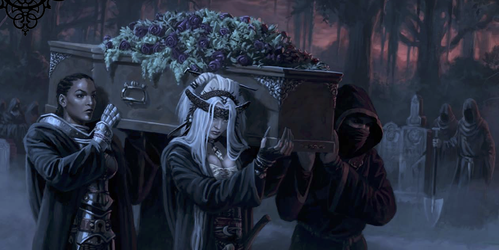

# The Funeral of Petros Lorrimor
## The Burial of Professor Lorrimor 
Heavily overcast skies prevented any warmth from the sun as dusk approached the little Ustalavian town of Ravengro. A small group had gathered around a casket outside the Restlands, a large stretch of moorland reserved for interring Ravengro’s dead. A few were local citizens, old friends of the deceased no doubt, but several were clearly strangers to the town.

A young woman accompanied by a middle-aged gentleman strode from town to the cemetery entrance  where the group was gathered. Poshly dressed, the gentleman was clearly a town citizen of import. The young woman, dressed in dark conservative clothes of mourning, was quite attractive although her eyes were red and puffy. She warmly greeted each of the locals by name and thanked them for coming. Then she turned to the dwarf, and the first natural smile came to her face as she let him pull her into an embrace.
> "Torrin! I'm so glad that you were able to make it."

Tears filled the dwarf's brown eyes.
> "Ah lass, if only I'd been here to watch over him. I can't believe he's gone."

Finally she turned to the strangers with mix of curiosity, sadness, and relief.  
> “I am Kendra Lorrimor. Each of you has my deepest gratitude for answering my late father’s request. I feared the summons would not reach you in time”

Nodding at the gentleman who accompanied her she added with a sigh,
>“Councilman Hearthmount will conduct the reading of the will shortly after the funeral service. With things the way they are in town these days, I suppose this may be everyone, but where are the pallbearers that are supposed to be here?”

Councilman Hearthmount spoke up, his tone comforting yet patronizing,
>“We must proceed, Kendra. Dusk approaches, and Father Grimburrow is no doubt waiting for us at the site. It would seem we require volunteers to serve as pallbearers.”

After a brief awkward pause, Torrin and five of the strangers positioned themselves around the casket and lifted it. Kendra Lorrimor then led the procession into the cemetery along the gravel walkway.
 
Kendra lead the somber procession along the gravel pathway winding through the cemetary, known as the Dreamwake. Rounding the corner onto a separate path, the group found the the way ahead was blocked by a dozen surly looking locals. The tallest of these toughs, an elderly but wiry man spoke out a challenge.
> That’s far enough. We been talking, and we don’t want Lorrimor buried in the Restlands. You can take him upriver and bury him there if you want, but he ain’t goin’ in the ground here!

Kendra's response was swift and fierce,
> What are you talking about? All arrangements have been made with Father Grimburrow. He’s waiting for us! The grave’s already been...

But the surly old man interrupted,
> You don’t get it, woman. We won’t have a necromancer buried in the same place as our kin. I suggest you move out while you still can. Folks are pretty upset about this right now.

Unable to tolerate this outrageous breach of protocol, Ludmilla announced herself as a cleric of Pharasma and rebuked the local thugs. Their resolve broken they sullenly dispersed, shooting venomous glances at the party and Kendra. The elderly ringleader spat out a final threat as he departed
> This is not over woman!

Kendra thanked Ludmilla profusely and apologized for the altercation. The attending councilors professed shock as well. They recognized the toughs as local farmhands, all of low character, and identified the ringleader as Gibs Hephanus, a retired soldier.

Father Grimburrow arrived moments later and also expresses shock at the audacity of the confrontation.
> My Friends, I am terribly sorry for the behavior that Gibs has shown today. These people know better than to intrude upon the holy rites of Pharasma. You can be assured that I will be speaking with the town sheriff and see that they are properly disciplined. Now, let us continue with this solemn task.

The procession continued without further complication to the plot, where the pallbearers handed the coffin over to the gravediggers who lowered it into the open grave. Father Grimburrow gave a short sermon. Then Kendra, fighting back tears, briefly recounted a few of her father’s more courageous or selfless moments before inviting others to share stories or remembrances.

Kvalca Sain spoke first,
> Today we say goodbye to great man. Petros Lorrimor was a man of both great intellect and great compassion. In this land of darkness Petros was a light, and with his passing the world has become a bit darker.

Adivion Adrissant spoke next,
> Professor Petros Lorrimor was a man of great insight, with a keen and enquiring mind. It was perhaps inevitable that it would be his curiosity that brought him low, for his questing ways led him to dark places, and what he lacked in prudence he more than compensated for in courage. Regardless, I shall remember him fondly as one who was almost a peer; as a man of intelligence, tempered but lightly by prudence.

Torrin gave a brief statement before choking up,
> I traveled a fair bit with the Professor. Dark places he sought, true enough, but “knowledge is our most powerful weapon against evil “ he’d always say. Course I tend to put my faith in a good axe in my hand. But he weren’t just a man of learnin’ and questin’, he was a father, and a mighty devoted one at that.

Ihrin spoke next,
> I met the Professor in one of those dark places to our mutual benefit. Petros Lorrimor was the rare breed of man that could not only see hope and potential in the lost, but open their eyes to it as well. Our time together was brief, but it has left me forever changed for the better.

Razvan's remembrance was particularly grim,
> A great ally in the fight against darkness has been lost. Yet those sinister forces that would prey upon good citizens take heed. Our resolve in this fight is only strengthened and we will hunt them down wherever they hide and rain doom upon them.

Calvinus' remembrance was far more uplifting,
> I was fortunate enough to spend time under the tutelage of Professor Lorrimor, and I will always look back fondly on those hours of intellectual exploration and debate. Alas, my time with the dear professor was too short as my studies took me... elsewhere. I will remain, however, forever in his debt for opening those intellectual doors.

Ludmilla's account was also moving,
> When word reached me of Petros Lorrimor's untimely passing, my first thought was 'not this year, not yet.' I also was blessed to work with the Professor on a common concern, and his assistance has proven invaluable. Although he has passed into the realm of the Lady of Graves, our need is great for men of the professor's caliber. I, for one, intend to honor his legacy by protecting the good citizens of Ustalav from the nefarious forces that would do them harm.

Upon the conclusion of the funeral, Kendra said her goodbyes to the other guests and then invited the visitors to her home for a drink and to hear his last will and testament. Councilman Vashian Hearthmount, the will executor who's presence was required for the reading, had some other matters to attend to first, but assured Kendra that he should arrive in about an hour's time.

## The Reading of the Will
