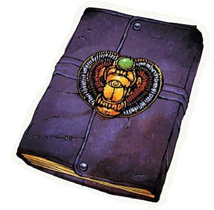

# Gameplay Session 1-01
Party Members:

- [Calvinus Asina](../Team/calvinusAsina.md)
- [Ludmilla Moonbrand](../Team/ludmillaMoonbrand.md)
- [Ihrin Tomovici](../Team/ihrinTomovici.md)
- [Razvan Fellstalker](../Team/razvanFellstalker.md)
- [Torrin Grimhood](../Team/torrinGrimhood.md)

## The Funeral of Petros Lorrimor
Heavily overcast skies prevented any warmth from the sun as dusk approached the little Ustalavian town of Ravengro. A small group had gathered around a casket outside the Restlands, a large stretch of moorland reserved for interring Ravengro’s dead. A few were local citizens, old friends of the deceased no doubt, but several were clearly strangers to the town.  

- Councilman Gharen Muricar
- Zohar Elkarid, the local tavern keeper, and his son, Perrin
- Jominda Fallenbridge, the apothecary
- Adivion Adrissant
- Kvalca Sain
- Horace Croon

A young woman accompanied by a middle-aged gentleman strode from town to the cemetery entrance  where the group was gathered. Poshly dressed, the gentleman was clearly a town citizen of import. The young woman, dressed in dark conservative clothes of mourning, was quite attractive although her eyes were red and puffy. She warmly greeted each of the locals by name and thanked them for coming. Then she turned to the dwarf, and the first natural smile came to her face as she let him pull her into an embrace.
> "Torrin! I'm so glad that you were able to make it."

Tears filled the dwarf's brown eyes.
> "Ah lass, if only I'd been here to watch over him. I can't believe he's gone."

Finally she turned to the strangers with mix of curiosity, sadness, and relief.  
> “I am Kendra Lorrimor. Each of you has my deepest gratitude for answering my late father’s request. I feared the summons would not reach you in time”

Nodding at the gentleman who accompanied her she added with a sigh,
>“Councilman Hearthmount will conduct the reading of the will shortly after the funeral service. With things the way they are in town these days, I suppose this may be everyone, but where are the pallbearers that are supposed to be here?”

Councilman Hearthmount spoke up, his tone comforting yet patronizing,
>“We must proceed, Kendra. Dusk approaches, and Father Grimburrow is no doubt waiting for us at the site. It would seem we require volunteers to serve as pallbearers.”

After a brief awkward pause, Torrin and five of the strangers positioned themselves around the casket and lifted it. Kendra Lorrimor then led the procession into the cemetery along the gravel walkway.
 
 - Kvalca Sain
 - Adivion Adrissant
 - Razvan Fellstalker
 - Ludmilla Moonbrand
 - Ihrin Tomovici
 - Torrin Grimhood

### Trouble on the Dreamwake
Kendra lead the somber procession along the gravel pathway winding through the cemetary, known as the Dreamwake. Rounding the corner onto a separate path, the group found the the way ahead was blocked by a dozen surly looking locals. The tallest of these toughs, an elderly but wiry man spoke out a challenge.
> That’s far enough. We been talking, and we don’t want Lorrimor buried in the Restlands. You can take him upriver and bury him there if you want, but he ain’t goin’ in the ground here!

Kendra's response was swift and fierce,
> What are you talking about? All arrangements have been made with Father Grimburrow. He’s waiting for us! The grave’s already been...

But the surly old man interrupted,
> You don’t get it, woman. We won’t have a necromancer buried in the same place as our kin. I suggest you move out while you still can. Folks are pretty upset about this right now.

Unable to tolerate this outrageous breach of protocol, Ludmilla announced herself as a cleric of Pharasma and rebuked the local thugs ^(Persuasion 21). 

Their resolve broken they sullenly dispersed, shooting venomous glances at the party and Kendra. The elderly ringleader spat out a final threat as he departed
> This is not over woman!

Kendra thanked Ludmilla profusely and apologized for the altercation. The attending councilors professed shock as well. They recognized the toughs as local farmhands, all of low character, and identified the ringleader as Gibs Hephanus, a retired soldier.

Father Grimburrow arrived moments later and also expresses shock at the audacity of the confrontation.
> My Friends, I am terribly sorry for the behavior that Gibs has shown today. These people know better than to intrude upon the holy rites of Pharasma. You can be assured that I will be speaking with the town sheriff and see that they are properly disciplined. Now, let us continue with this solemn task.

### The Burial
The procession continued without further complication to the plot, where the pallbearers handed the coffin over to the gravediggers who lowered it into the open grave. Father Grimburrow gave a short sermon. Then Kendra, fighting back tears, briefly recounted a few of her father’s more courageous or selfless moments before inviting others to share stories or remembrances.

Kvalca Sain spoke first,
> Today we say goodbye to great man. Petros Lorrimor was a man of both great intellect and great compassion. In this land of darkness Petros was a light, and with his passing the world has become a bit darker.

Adivion Adrissant spoke next,
> Professor Petros Lorrimor was a man of great insight, with a keen and enquiring mind. It was perhaps inevitable that it would be his curiosity that brought him low, for his questing ways led him to dark places, and what he lacked in prudence he more than compensated for in courage. Regardless, I shall remember him fondly as one who was almost a peer; as a man of intelligence, tempered but lightly by prudence.

Torrin gave a brief statement before choking up, ^(Persuasion 10)
> I traveled a fair bit with the Professor. Dark places he sought, true enough, but “knowledge is our most powerful weapon against evil “ he’d always say. Course I tend to put my faith in a good axe in my hand. But he weren’t just a man of learnin’ and questin’, he was a father, and a mighty devoted one at that.

Ihrin spoke next, ^(Persuasion 19)
> I met the Professor in one of those dark places to our mutual benefit. Petros Lorrimor was the rare breed of man that could not only see hope and potential in the lost, but open their eyes to it as well. Our time together was brief, but it has left me forever changed for the better.

Razvan's remembrance was particularly grim, ^(Persuasion 6)
> A great ally in the fight against darkness has been lost. Yet those sinister forces that would prey upon good citizens take heed. Our resolve in this fight is only strengthened and we will hunt them down wherever they hide and rain doom upon them.

Calvinus' remembrance was far more uplifting, ^(Persuasion 18)
> I was fortunate enough to spend time under the tutelage of Professor Lorrimor, and I will always look back fondly on those hours of intellectual exploration and debate. Alas, my time with the dear professor was too short as my studies took me... elsewhere. I will remain, however, forever in his debt for opening those intellectual doors.

Ludmilla's account was also moving, ^(Persuasion 16)
> When word reached me of Petros Lorrimor's untimely passing, my first thought was 'not this year, not yet.' I also was blessed to work with the Professor on a common concern, and his assistance has proven invaluable. Although he has passed into the realm of the Lady of Graves, our need is great for men of the professor's caliber. I, for one, intend to honor his legacy by protecting the good citizens of Ustalav from the nefarious forces that would do them harm.

Upon the conclusion of the funeral, Kendra said her goodbyes to the other guests and then invited the visitors to her home for a drink and to hear his last will and testament. Councilman Vashian Hearthmount, the will executor who's presence was required for the reading, had some other matters to attend to first, but assured Kendra that he should arrive in about an hour's time.

%% Adivion, Horace, and Kvalca made their farewells

## The Reading of the Will

### Waiting for Councilman Vashian
Kendra provided drinks and encouraged her guests to make themselves comfortable. She had no idea what the will might contain, only that it stipulated that all the assembled individuals be present for its reading.

The visitors made fuller introductions.

- Torrin
- Ludmilla
- Calvinus
- Ihrin
- Razvan
- Kvalca
- Adivion

Making a visible effort to compose herself, Kendra took a couple of deep breaths before relating the sad tale,
> Some weeks back, something caused my father to become obsessed with Harrowstone prison. Harrowstone is a ruined prison— partially destroyed by a fire over fifty years ago, the building has stood vacant ever since. Many of the locals suspect that it’s haunted, and don’t enjoy speaking of the place. It's strange, because we have lived here for years, and despite its tragic history, father never paid it much mind. Then while on the prison grounds one night, part of an old gargoyle broke off and struck him. Sheriff Caeller says he was killed instantly. The town has officially declared the prison and its grounds off limits, and the sheriff has deputies patrolling the exterior to enforce that decree.

Before the guests could ask any questions, a knock on the door announced Councilman Hearthmount arrival. Adivion and Kvalca made their farewells, and Kendra led everyone to her father’s old study for the reading of the will.

### The Reading
Once everone was seated, Councilman Vashian produced a scroll case, showed that the professor’s personal seal was unbroken, then broke the wax and opened the case. As he did, a small iron key fell out of the tube, clattering noisily onto the table. Undaunted by the key, the councilman retrieved a parchment and collection of small envelopes from the case and began to read, obviously eager to be done with the business and to get back home.
> “I, Petros Lorrimor, being of sound mind, do hereby commit to this parchment my last will and testament. Let it be known that, with the exception of the specific details below, I leave my home and personal belongings entire to my daughter Kendra. Use them or sell them as you see fit, my child.
> 
>Yet beyond the bequeathing of my personal effects, this document must serve other needs. I have arranged for the reading of this document to be delayed until all principals can be in attendance, for I have more than mere inheritance to apportion. I have two final favors to ask.
> 
>To my old friends, I hate to impose upon you all, but there are few others who are capable of appreciating the true significance of what it is I have to ask. As some of you know, I have devoted many of my studies to all manner of evil, that I might know the enemy and inform those better positioned to stand against it. For knowledge of one’s enemy is the surest path to victory over its plans.
>
>And so, over the course of my lifetime, I have seen fit to acquire a significant collection of valuable but dangerous tomes, any one of which in the wrong circumstances could have led to an awkward legal situation. While the majority of these tomes remain safe under lock and key at the Lepidstadt University, I fear that a few I have borrowed remain in a trunk in my Ravengro home. While invaluable for my work in life, in death, I would prefer not to burden my daughter with the darker side of my profession, or worse still, the danger of possessing these tomes herself. As such, I am entrusting my chest of tomes to you, posthumously. I ask that you please deliver the collection to my colleagues at the University of Lepidstadt, who will put them to good use for the betterment of the cause.
>
>Yet before you leave for Lepidstadt, there is the matter of another favor—please delay your journey one month and spend that period of time here in Ravengro to ensure that my daughter is safe and sound. She has no one to count on now that I am gone, and if you would aid her in setting things in order for whatever she desires over the course of this month, you would have my eternal gratitude. From my savings, I have also willed to each of you a sum of one hundred platinum coins. For safekeeping, I have left  these funds with Embreth Daramid, one of my most trusted friends in Lepidstadt—she has been instructed to issue this payment upon the safe delivery of the borrowed tomes no sooner than one month after the date of the reading of this will.
>
> I, Petros Lorrimor, hereby sign this will in Ravengro on this first day of Calistril, in the year 4717” 

Councilman Vashian then distributed the envelopes, each addressed to a party member. His responsibilities satisfied, the councilman looked to Kendra, who thanked and dismissed him. Collecting his things, he gave the newcomers a final disparaging look before departing. Kendra apologized for the councilman's manner, explaining the town's general suspicious and superticious nature. Putting on a brave face, she informed them that she’ll need at least a few weeks to decide if she wants to sell her family home or remain here in Ravengro—in the meantime, as stipulated by the will, she asked the PCs to remain as well. She offered rooms in her spacious house for the PCs, promising them free room and board for the month the will requests them to remain in town, and then excused herself to go fetch the chest mentioned in the will. Alone and puzzled at the revelations, they each opened and read the letters that they had been given.

### The Letters

### The Tomes
The chest itself was a relatively small object of oak and iron. Kendra, nervous about the contents, handed the key to the Torrin to have the honor of opening the chest. The key fit the lock perfectly, and within the dwarf found several books. Three were old tomes with jet black leather covers and bound together in twine with a note indicating that they should be deliverd to one Montagnie Crowl, a professor of antiquities at Lepistadt University. A light brown leather journal, obviously much newer, had an attached note with the phrase “Read me now!” The final tome was bound in a rich purple leather cover with an elaborate brass scarab set with a single eye in the center. It's attached note indicated that it should be delivered discretely to Embreth Daramid, a judge at the Lepidstadt Courthouse, at her home address, which was provided. Only this tome was locked with no key to be found within the chest. Ihrin appraised it to be an very high quality lock that would be exceptionally difficult to pick. No one was familiar with the strange beetle symbol on its cover.

After flipping through the journal, Calvinus discovered that some of the entries had been circled in red ink. Calling the others over, he found the first marked entry dated one year back.
> The Whispering Way is more than just a cabal of necromancers. I see that now. Undeath is their fountain of youth. Uncovering their motivation does not place me at ease as I thought it might. Their desire to be eternal simply makes them more dangerous.

Ludmilla, Razvan, and Calvinus recognized the The Whispering Way as a sinister organization of necromancers that has been active in the Inner Sea region for thousands of years. The others were unfamiliar with the organization.

The next marked entry was from two months back.
> It is as I feared. The Way is interested in something here in Ravengro. But what could it be?

The next marked entry was from one month back.
> Whatever the Way seeks, I am now convinced their goal is connected to Harrowstone. In retrospect, I suppose it all makes sense - the stories they tell about the ruins in town are certainly chilling enough. It may be time to investigate the ruins, but with everyone in town already being so worked up about them, I'd rather not let the others know about my curiosity - there's plenty of folks hereabouts who already think I'm a demonologist or a witch or something. Ignorant fools!

Kendra shared the basic local knowledge of the prison: Harrowstone is a ruined prison just outside town that was built in 4594. In fact, Ravengro was founded at the same time as a place where the guards and their families could live and that would produce food and other supplies used by the prison. A horrible fire in 4661 killed all of the prisoners and most of the guards destroyed a large portion of the prison’s underground eastern wing, but left most of the stone structure above relatively intact. The prison’s warden perished in the fire, along with his wife, although no one knows why she was in the prison when the fire occurred. A statue commemorating the warden and the guards who lost their lives was built in the months after the tragedy—that statue still stands on the riverbank just outside of town. Many of the locals suspect the site is haunted and won't speak of the place. Ihrin added that Harrowstone was infamous amongst the criminal world as most of the hardened criminals sent to Harrowstone spent only a few months imprisoned, for it was there that most of Ustalav’s executions during that era were carried out. 

The next marked entry was from twenty days ago.
> It is confirmed. The Way seems quite interested in something- no, strike that - someone who was held in Harrowstone. But who, specifically, is the Way after? I need a list of everyone who died the night of the fire. Everyone. The Temple of Pharasma must have such a list.

The next marked entry was from eighteen days ago.
> I see now just how ill prepared I was when I last set out for the Harrowstone. I am lucky to have returned at all. The ghosts, if indeed they were ghosts (for I did not find it prudent to investigate further) prevented me from transcribing the strange symbols I found etched along the foundation. Hopefully on my next visit I will be more prepared. Thankfully the necessary tools to defend against spirits are already here in Ravengro. I know that the Temple of Pharasma used to store them in a false crypt in the Restlands at the intersection between Eversleep and the Black Path. I am not certain if the current clergy even know of what their predecessors have hidden down below. If my luck holds, I should be able to slip in and out with a few borrowed items.

The final circled entry was on the day of his death.
> Tomorrow evening I return to the prison. It is imperative the Way does not finish. My caution had already cost me too much time. I am not sure what will happen if I am too late, but if my theory is right, the entire town could be at risk. I don't have time to update my will, so I'll leave this in the chest where it'll be sure to be found, should the worst come to pass.

A slow knock upon the front door interrupted their deliberations.

### The Sheriff's Visit
Kendra answered the door to find Sheriff Ben.

> Father Grimburrow informed me of the disruption this morning. I just wanted you to know I'll be having a stern discussion with those involved, particularly Gibbs.

Addressing the newcomers, he added,
> Please don't think this is common or acceptable behavior in this town. Ravengro has always been a close-knit community, and with all his travels and ... controversial pursuits, some never came to fully accept the Professor. Then of course nothing gets the rumors and superstitions stirred up around her like the abandoned prison.

Expressing his condolences to Kendra for her loss, he then made his departure, allowing the group to return to their discussion on how to proceed.
 
- Torrin insisted that a wake was in order for the professor.
- Ludmilla declared that she needed to speak with Father Grimburrow regarding the journal's revelations
- Ihrin wanted to stroll and get the lay of the land
- Calvinus and Razvan wanted to investigate the three older tomes

### The Wake
Drinking and sharing stories of the Professor. Even Razvan opens up a bit, in his own dour way. It becomes quickly apparent that Calvinus is not much of a drinking and passes out.
