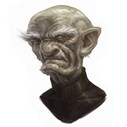

# Father Vauran Grimburrow
*Head priest of Pharasma in Ravengro*    
  

## Description
Bald, gaunt, and slightly stooped, Father Grimburrow is showing his years, but he is still quite spry although he uses a cane when he walks.

### Personality
Father Grimburrow is a stern, pious traditionalist whose sermons are filled with hellfire and brimstone. His primary interests are religion, history, and community traditions. He dislikes troublemakers and pranksters, and likes to put youngsters in there place. He has a strong respect, bordering on fear, of the supernatural, but strongly opposes evil.

### Habits/Mannerisms
Father Grimburrow is infamous for hitting people with his ever-present cudgel when they curse or act inappropriately.

## Key Interactions

### Chapter 1
- 