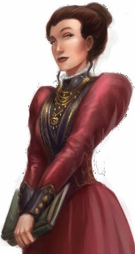

# Kendra Lorrimor
*Kendra is the daughter of the famed Professor Petros Lorrimor*    
  

## Description
Kendra is a trim and attractive 25-year-old woman

### Personality
Kendra is friendly and outgoing although she is an unabashed bookworm. Her primary interests are the occult, history, and alchemy. She dislikes crude, unpredictable, and uncivilized people, and she abhors violence.

### Habits/Mannerisms

- Talks slowly considering every word
- Seems shocked when people are crude
- Tends to fiddle with her handkerchief when nervous

##Background
Kendra has lived in Ravengro for nearly 15 years, having moved here with her family as a child from Lepidstadt after her father retired from teaching shortly after her mother's brutal death at the hands of the Beast of Lepistadt. Kendra would likely have been killed as well were it not for the intervention of [Torrin Grimhood](../Team/Torrin\ Grimhood.md). Her father often employed Torrin as a bodyguard after that fateful night, and she developed a familial relationship, referring to the doughty dwarf as 'Uncle Torrin.'

### Secrets

1. Kendra once read a vile book owned by her father and released… something

## Key Interactions

### Chapter 1

- 