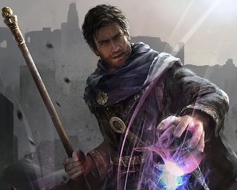

# Calvinus Asina
*Calvinus is an obsessed human warlock seeking to unlock a mystery that plagues him*  
  
Neutral Male Human Warlock (2)
## Stats
|**Ability**|**STR**|**DEX**|**CON**|**INT**|**\*WIS\***|**\*CHA\***|**SAN**|
| ---- | ---- | ---- | ---- | ---- | ---- | ---- | ---- |
|Mod (Val)| +0 (10) | +1 (13) | -1 (8) | +3 (16) | +1 (12) | +3 (16) | +0 (11) |
|**Save**| +0 | +1 | -1 | +3 | +3 | +5 | +0 |

- AC: 12
- Init: +1
- Size: Medium
- Speed: 30 feet
- HD: 2 / 2d8
- hp: 14 / 14
- Proficiency: +2

### Offense
Calvinus is not a fighter, melee or ranged. He keeps his distance and primarily uses eldritch blast.

| Weapon | Attack Bonus | Damage | Notes |
| ---- | ---- | ---- | ---- |
| quarterstaff | +0 | 1d6 (bludge) / 1d8 (2-h) | versatile |
| dagger | +1 | 1d4+1 (pierce) | finess, light, range 20/60 |

### Spells
- +5 attack, DC 13
- 2 cantrips, 3 known spells, 2/2 spell slot 

| Level | Name | Cast/Range/Comp/Dur | Notes |
| ---- | ---- | ---- | ---- |
| 0 | eldritch blast | action, 120 ft, V/S, instant | A beam of crackling energy streaks toward a creature within range. Make a ranged spell attack against the target. On a hit, the target takes 1dl0 force damage.|
| 0 | blade ward | action, self, V/S, 1 rd | Until the end of your next turn, you have resistance against bludgeoning, piercing, and slashing damage dealt by weapon attacks. |
| 1 | arms of hadar | action, self, V/S, instant | Tendrils of dark energy erupt from you and batter all creatures within 10 feet of you. Each creature in that area must make a Strength saving throw. On a failed save, a target takes 2d6 necrotic damage and can’t take reactions until its next turn. On a successful save, the creature takes half damage, but suffers no other effect. |
| 1 | dissonant whispers| action, 60 ft, V, instant | You whisper a discordant melody that only one creature of your choice within range can hear, wracking it with terrible pain. The target must make a Wisdom saving throw. On a failed save, it takes 3d6 psychic damage and must immediately use its reaction, if available, to move as far as its speed allows away from you. The creature doesn’t move into obviously dangerous ground, such as a fire or a pit. On a successful save, the target takes half as much damage and doesn’t have to move away. A deafened creature automatically succeeds on the save. |
| 1 | protect from evil and good | action, touch, VSM, Conc 10min max| one willing creature you touch is protected against certain types of creatures: aberrations, celestials, elementals, fey, fiends, and undead. The protection grants several benefits. Creatures of those types have disadvantage on attack rolls against the target. The target also can’t be charmed, frightened, or possessed by them. If the target is already charmed, frightened, or possessed by such a creature, the target has advantage on any new saving throw against the relevant effect. |

| Skill | Mod | Notes
| ---- | ---- | ---- |
| Acrobatics (Dex) | +1 ||
| Animal Handling (Wis) | +1 ||
| Arcana (Int) | +5 | (P) |
| Athletics (Str) | +0 ||
| Deception (Cha) | +5 | (P) |
| History (Int) | +5 | (P) |
| Insight (Wis)| +1 ||
| Intimidation (Cha) | +3 ||
| Investigation (Int) | +5 | (P)  20 passive|
| Medicine (Wis) | +1 ||
| Nature (Int) | +2 ||
| Perception (Wis) | +1 | 16 passive |
| Performance (Cha) | +3 ||
| Persuasion (Cha) | +5 | (P) |
| Religion (Int) | +3 ||
| Sleight of Hand (Dex) | +1 ||
| Stealth (Dex) | +1 ||
| Survival (Wis) | +1 ||

### Abilities
- **Observant**: If you can see a creature’s mouth while it is speaking a language you understand, you can interpret what it’s saying by reading its lips.
- **Researcher**: When you attempt to learn or recall a piece of lore, if you do not know that information, you often know where and from whom you can obtain it. Usually, this information comes from a library, scriptorium, university, or a sage or other learned person or creature.
- **Otherwordly Patron**: The Great Old One
	- Awakened Mind: You can communicate telepathically with any creature you can see within 30 feet of you. You don’t need to share a language with the creature for it to understand your telepathic utterances, but the creature must be able to understand at least one language.
- **Eldritch Invocations**
	- **Eldritch Sight**: You can cast *detect magic* at will without expending a spell slot
	- **Repelling Blast**: When you hit a creature with *eldritch blast* you can push the creature up to 10 ft away from you in a straight line

### Proficiencies
- light armor
- simple weapons

### Languages
Common, Elvish, Abyssal, Draconic

## Gear
- leather armor
- quarterstaff
- 2 daggers
- arcane focus (ring)
- 1 potion of healing (2d4+2)
- 2 empty haunt siphons
- spirit board with brass planchette
- scholar's backpack
	- book of lore, 
	- bottle of ink, an ink pen, parchment (10), little bag of sand
	- small knife
- common clothes

### Funds
- 10 gp

## Description
- Age: 24
- Height: 5' 6"
- Weight: 126 lbs

Small and frail, Calvinus nevertheless has an intensity and passion about him that cannot be ignored.

## Personality/Mannerisms

### Quips

### Traits
- I am convinced that people are always trying to steal my secrets
- I have spent so much time immersed in libraries that I have little practical experience dealing with people in the outside world

### Ideals
- **Knowledge**. The path to power and self-improvement is through knowledge.

### Bonds
- I've been searching my whole life for the answer to a certain question

### Flaws
- Unlocking an ancient mystery is worth the price of a civilization

## Background (Sage - researcher)

### Campaign Introduction
Professor Lorrimor traveled the Inner Sea region lecturing and teaching at universities in locations as far-flung as Manaket and Magnimar, and as different in scope as the bardic colleges of Taldor and the battle colleges of the River Kingdoms. Speaking before standing-room-only lecture halls on topics as widely ranging as military strategy, planar anomalies, theology, and agriculture, Lorrimor's time was highly valued among those ambitious to benefit from his expertise. Despite this, he still managed to provide one-on-one assistance to the most promising of his acolytes. When he saw the potential for greatness in one of his charges, he took it upon himself to nurture their spark. You were such a student. Over the course of several months, you and the late professor spent hours debating the finer points of your topic of interest, and the intellectual doors he opened for you continue to flavor your outlook on the world.

### History
- Homeland: 
- Circumstances of Birth: 
- Parents: 
- Siblings: 
- Parent's Professions:
- Childhood Event:
- Training: Mercenary
- Influential Associate:
- Moral Conflict: 
- Romantic Relationships: 

### Family / Allies

### Enemies / Antagonists

### Contacts

### Big Goals / Motivations

1. 

### Secrets
1.  You opened an eldritch tome and saw things unfit for a sane mind. You burned the book, but its words and images are burned into your psyche. This is the source now of the question.

### Story Arcs
1. 