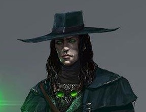

# Razvan Fellstalker
*Razvan is a dour human witch hunter seeking to end his family's curse.*  
  
Lawful Neutral Male Human Witch Hunter (2)

## Stats
|**Ability**|**\*STR\***|**DEX**|**CON**|**INT**|**\*WIS\***|**CHA**|**SAN**|
| ---- | ---- | ---- | ---- | ---- | ---- | ---- | ---- |
|Mod (Val)| +2 (14) | +1 (12) | +3 (16) | +0 (10) | +2 (14) | -1 (8) | +0 (11) |
|**Save**| +4 | +1 | +3 | +0 | +4 | -1 | +0 |

- AC: 13
- Init: +6
- Size: Medium
- Speed: 30 feet
- HD: 2 / 2d8
- hp: 21 / 21 or 18 / 19 (blood rite)
- Proficiency: +2

### Offense

| Weapon | Attack Bonus | Damage | Notes |
| ---- | ---- | ---- | ---- |
| glaive | +4 | 1d10+2 (slash) | heavy, 2-h, 10' reach |
| dagger | +4 | 1d4+2 (pierce) | finess, light, range 20/60 |
| light crossbow | +3 | 1d8+1 (pierce) | range 80/320, loading, 2-h, 20/20 bolts |

| Skill | Mod | Notes
| ---- | ---- | ---- |
| Acrobatics (Dex) | +1||
| Animal Handling (Wis) | +2 ||
| Arcana (Int) | +0 ||
| Athletics (Str) | +4 | (P) |
| Deception (Cha) | -1 ||
| History (Int) | +2 | (P) |
| Insight (Wis)| +4 | (P) |
| Intimidation (Cha) | -1 ||
| Investigation (Int) | +0 ||
| Medicine (Wis) | +2 ||
| Nature (Int) | +0 ||
| Perception (Wis) | +2 | 12 passive |
| Performance (Cha) | -1 ||
| Persuasion (Cha) | +1 | (P) |
| Religion (Int) | +0 ||
| Sleight of Hand (Dex) | +1 ||
| Stealth (Dex) | +1 ||
| Survival (Wis) | +4 | (P, A)|

### Abilities
- **Alert**: Always on the lookout for danger, you gain the following benefits:
	- You gain a +5 bonus to initiative.
	- You can’t be surprised while you are conscious.
	- Other creatures don’t gain advantage on attack rolls against you as a result of being hidden from you.
- **Heart of Darkness**: Those who look into your eyes can see that you have faced unimaginable horror and that you are no stranger to darkness. Though they might fear you, commoners will extend you every courtesy and do their utmost to help you. Unless you have shown yourself to be a danger to them, they will even take up arms to  fight alongside you, should you  find yourself facing an enemy alone.
- **Hunter's Bane**: You have advantage on Survival checks to track Fey, Fiends, and Undead and Int checks to recall information about them.
- **Blood Rite** (2hp cost): as a bonus action you can wound yourself and embue a single weapon with elemental energy that lasts until your next long rest. max hitpoint reduction can only be restored by long rest.
	- weapon treated as magical with +1 attack bonus
	- Rite of the Storm: +1d4 lightning damage

### Proficiencies
- light, medium armor
- simple and martial weapons
- alchemist supplies
- dragon chess

### Languages
Common,  Giant, Primordial

## Gear
- glaive
- light crossbow and quiver
- 5 bolts of disruption (attuned, +1 attack vs fiends/undead, +2d6 radiant dmg, >= 15hp DC15 Wisdom save or be destroyed)
- 2 daggers
- studded leather armor
- signet ring and scroll of pedigree
- 2 flasks of holy water
- 2 potions of cure wounds (2d4+2)
- driftglobe
- monster hunter's backpack
	-  bedroll, mess kit, tinderbox
	- 10 torches
	- 10 days of rations, and a waterskin
	- 50 feet of hempen rope strapped to the side of it.

### Funds
- 25 gp

## Description
- Age: 22
- Height: 6' 1"
- Weight: 216 lbs

## Personality/Mannerisms
- Razvan is dark and somber at all times. Any jest has the bite of sarcasm and condecension to it.

### Quips

### Traits
- I live for the thrill of the hunt.
- I put no trust in divine beings.

### Ideals
- I’ll stop the spirits that haunt me or die trying.

### Bonds
- There’s evil in me, I can feel it. It must never be set free.

### Flaws
- I feel no compassion for the dead for they are the lucky ones

## Background (Haunted One)
Razvan's family has a history of practicing the dark arts. He dabbled once and felt something horrible clutch at his soul, whereupon he fled in terror.

### Campaign Introduction
At some point in the past, Professor Lorrimor did Razvan a favor under the condition that he would someday call on him to repay it. Razvan never saw nor heard from him again, however, leaving the outcast noble with a sense of unending anticipation that each day might be the day he would be asked to return the favor. Yet that day never came, and Razvan's fears and anxiety about what the professor would call on him to do abated. Assuming the old man had either forgotten about him or died, Razvan eventually assumed he'd never have to follow through on his end of the bargain. Upon receiving word of the professor's death, and that he had been named specifically in his will, Razvan's dread of what the professor could possibly want gnawed upon him throughout his entire journey to Ravengro.

### History
- Homeland: Large Town
- Circumstances of Birth: Cursed Birth
- Parents: Both Alive
- Siblings: 2
- Parent's Professions: Nobles (Baron and Baroness)
- Childhood Event: Betrayal
- Training: Schooled Warrior
- Influential Associate: The Dead One
- Moral Conflict: 
- Romantic Relationships: 

### Family / Allies

### Enemies / Antagonists

### Contacts

### Big Goals / Motivations

1. 

### Secrets
1.  Razvan is the first son and heir to the Dobrescu barony.

### Story Arcs
1. 