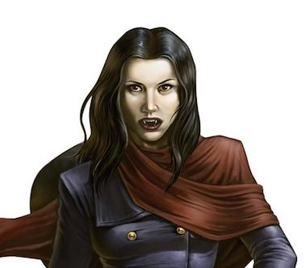

# Ihrin Tomovici
Ihrin is a daring dhampir rogue ...  
   
Chaotic Neutral Female Nobleblood Dhampir Rogue (2)
## Stats
|**Ability**|**STR**|**\*DEX\***|**CON**|**\*INT\***|**WIS**|**CHA**|**SAN**|
| ---- | ---- | ---- | ---- | ---- | ---- | ---- | ---- |
|Mod (Val)| +0 (10) | +2 (15) | +2 (14) | +2 (14) | -1 (8) | +2 (14) | +0 (11) |
|**Save**| +0 | +4 | +2 | +4 | -1 | +2 | +0 |

- AC: 13
- Init: +2
- Size: Medium
- Speed: 30 feet
- HD: 2 / 2d8
- hp: 18 / 18
- Proficiency: +2

### Offense
Ihrin avoids melee combat when possible and strives to never be in a fair fight.

| Weapon | Attack Bonus | Damage | Notes |
| ---- | ---- | ---- | ---- |
| rapier | +4 | 1d8+2 (pierce) | finesse |
| dagger | +4 | 1d4+2 (pierce) | finess, light, range 20/60 |
| shortbow | +4 | 1d6+2 (pierce) | range 80/320, 19/20 arrows |

| Skill | Mod | Notes
| ---- | ---- | ---- |
| Acrobatics (Dex) | +4 | (P) |
| Animal Handling (Wis) | -1 ||
| Arcana (Int) | +2 ||
| Athletics (Str) | +0 ||
| Deception (Cha) | +4 | (P) |
| History (Int) | +2 ||
| Insight (Wis)| -1 ||
| Intimidation (Cha) | +4 ||
| Investigation (Int) | +4 | (P) |
| Medicine (Wis) | -1 ||
| Nature (Int) | +2 ||
| Perception (Wis) | -1 | 9 passive |
| Performance (Cha) | +4 | (P) |
| Persuasion (Cha) | +4 | (P) |
| Religion (Int) | +2 ||
| Sleight of Hand (Dex) | +4 | (P) |
| Stealth (Dex) | +6 | (P,E) |
| Survival (Wis) | -1 ||

### Abilities
- **Darkvision**: 60’
- **Hard to Kill**. advantage on death saving throws.
- **Sunlight Sensitivity**. disadvantage on attack rolls and on Wisdom (Perception) checks that rely on sight when you, the target of your attack, or whatever you are trying to perceive is in direct sunlight.
- **Unnatural Resilience**. advantage on poison saving throws and have resistance against necrotic damage.
- **Mesmerizing Presence**. When a creature Ihrin can see makes a saving throw against an illusion or charm effect, she can use her reaction to spend and roll a Hit Die, adding the result to the DC of that saving throw. She can do this after the creature makes its saving throw but before the DM declares whether or not it was successful.
- **Natural Grace**. proficiency in Persuasion.
- **Criminal Contact**: You have a reliable and trustworthy contact who acts as your liaison to a network of other criminals. You know how to get messages to and from your contact, even over great distances; specifically, you know the local messengers, corrupt caravan masters, and seedy sailors who can deliver messages for you.
- **Expertise**: 2x proficiency bonus (Thieves' Tools, Stealth)
- **Sneak Attack**: +1d6 damage
- **Cunning Action**: You can take a bonus action (Dash, Disengage, or Hide) on each turn in combat.

### Proficiencies
- light armor
- simple weapons, hand crossbows, longswords, rapiers, shortswords
- dice
- thieves' tools (E)

### Languages
Common,  Elvish, Thieves' Cant, Halfling

## Gear
- rapier
- shortbow and quiver
- 10 silvered arrows
- 2 daggers
- leather armor
- dark set of common clothes, including hood
- thieves' tools
- 1 potion of cure wounds (2d4+2)
- 2 flasks of holy water
- burglar's backpack
	- a bag of 1,000 ball bearings, 
	- 10 feet of string, 
	- a bell, 
	- 5 candles, 
	- a crowbar, a hammer, 10 pitons, 
	- a hooded lantern, 2 flasks of oil, and tinderbox
	- 5 days rations and a waterskin. 
	- 50 feet of hempen rope strapped to the side of it.

### Funds
- 15 gp

## Description
- Age: 62
- Height: 4' 3"
- Weight: 166 lbs

## Personality/Mannerisms
- Ihrin thrives on daring situations

### Quips

### Traits
- I don't pay attention to the risks in a situation. Never tell me the odds

### Ideals
- **Aspiration**. Through my skills and daring, my name will be reknown

### Bonds
- I am determined to escape the crime syndicate that I was sold into

### Flaws
- If there is a plan, I'll forget it. If I don't forget it, I'll ignore it

## Background (Criminal - burglar)

### Campaign Introduction
Fate smiled on Ihrin and Professor Lorrimor one day in the not so distant past. Through a matter of pure chance, Ihrin was in a position to save the late scholar’s life and did so. His gratitude was effusive, and he promised that he would never forget her. 
The guild leader summoned Ihrin and informed her she had been hired for a special job in Ravengro. The situation was quite unusual, but the price offered for her services was too good to pass up. A coach
Ihrin was unsure of the nature of the summons in his will, but believed he may have listed her as a possible heir in thanks for saving him from an untimely demise.

### History
- Homeland: Ustalav city of Ardis
- Circumstances of Birth: unknown
- Parents: unknown
- Siblings: unknown
- Parent's Professions: unknown
- Childhood Event: 
- Training: 
- Influential Associate: 
- Moral Conflict: 
- Romantic Relationships: 

### Family / Allies

### Enemies / Antagonists

### Contacts

### Big Goals / Motivations

1. Ihrin is naturally curious about her parentage
2. Ihrin desperately wants to break free from the thieves guild that she was sold into

### Secrets

1.  Ihrin keeps her dhampir race secret, passing herself off as a half-elf

### Story Arcs

1. link to vampires of book 6, Ashes at Dawn 