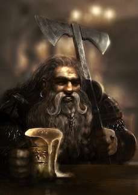

# Torrin Grimhood
Torrin is a doughty dwarf fighter ...  
  
Neutral Good Male Mountain Dwarf Fighter (2)

## Stats
|**Ability**|**\*STR\***|**DEX**|**\*CON\***|**INT**|**WIS**|**CHA**|**SAN**|
| ---- | ---- | ---- | ---- | ---- | ---- | ---- | ---- |
|Mod (Val)| +3 (17) | +0 (10) | +3 (16) | -1 (8) | +1 (12) | +1 (13) | +0 (11) |
|**Save**| +5 | +0 | +5 | -1 | +1 | +1 | +0 |

- AC: 16 (18 w/ shield)
- Init: -1
- Size: Medium
- Speed: 25 feet
- HD: 2 / 2d10
- hp: 24 / 24
- Proficiency: +2

### Offense
Torrin thrives in melee combat preferring to use his battleaxe with two-hands, but will switch to one hand with shield if the situation seems to call for it.

| Weapon | Attack Bonus | Damage | Notes |
| ---- | ---- | ---- | ---- |
| battleaxe | +5 | 1d8+3 (slash) / 1d10+3 (2-h, slash) | versatile |
| dagger | +5 | 1d4+3 (pierce) | finess, light, range 20/60 |
| light crossbow | +2 | 1d8 (pierce) | range 80/320, loading, 20/20 bolts|

| Skill | Mod | Notes
| ---- | ---- | ---- |
| Acrobatics (Dex) | +0 ||
| Animal Handling (Wis) | +1 ||
| Arcana (Int) | -1 ||
| Athletics (Str) | +5 | (P) |
| Deception (Cha) | +1 ||
| History (Int) | -1 | stonecunning(+3) |
| Insight (Wis)| +1 ||
| Intimidation (Cha) | +3 | (P) |
| Investigation (Int) | -1 ||
| Medicine (Wis) | +1 ||
| Nature (Int) | -1 ||
| Perception (Wis) | +3 | (P) 13 passive |
| Performance (Cha) | +1 ||
| Persuasion (Cha) | +1 ||
| Religion (Int) | -1 ||
| Sleight of Hand (Dex) | +0 ||
| Stealth (Dex) | +0 | (D-armor)|
| Survival (Wis) | +3 | (P) |

### Abilities
- **Darkvision**: 60’
- **Dwarven Resilience**: Advantage on save vs poison, resistance vs poison damage
- **Stonecunning**: 2x proficiency bonus for History(Int) with respect to stonework
- **Military Rank**: Torrin is a respected corporal of the Dhall Thalrul mercenary company. Soldiers loyal to Dhall Thalrul still recognize his authority and influence, and they defer to him if of a lower rank. Torrin can invoke his rank to exert influence over other soldiers and requisition simple equipment or horses for temporary use. He can also usually gain access to friendly military encampments and fortresses where his rank is recognized.
- **Great Weapon Fighting Style**: When you roll a 1 or 2 on a damage die for an attack you make with a melee weapon that you are wielding with two hands, you can reroll the die and must use the new roll, even if the new roll is a 1 or a 2. The weapon must have the two-handed or versatile property for you to gain this benefit.
- **Second Wind** (1 / short or long rest): You have a limited well of stamina that you can draw on to protect yourself from harm. On your turn, you can use a bonus action to regain hit points equal to 1d10 + your fighter level.
- **Action Surge** (1 / short or long rest): You can push yourself beyond your normal limits for a moment. On your turn, you can take one additional action on top of your regular action and a possible bonus action.

### Proficiencies
- simple weapons, martial weapons
- all armor, shields
- brewer’s supplies
- Three-Dragon Ante game
- vehicle (land)

### Languages
Common,  Dwarvish

## Gear
- chainmail
- shield
- battleaxe
- light crossbow and quiver
- 5 +1 bolts
- 1 potion of cure wounds (2d4+2)
- insignia of rank
- tusks of orc champion slain
- Three-Dragon Ante set
- explorer's backpack
	-  bedroll, mess kit, tinderbox
	- 10 torches
	- 10 days of rations, and a waterskin
	- 50 feet of hempen rope strapped to the side of it.

### Funds
- 10 gp

## Description
- Age: 62
- Height: 4' 3"
- Weight: 166 lbs

## Personality/Mannerisms
- Torrin is a pretty simple dwarf. Work hard, play hard, and live life as if tomorrow is not promised.
- Torrin has a particularly soft heart for children and animals

### Quips

### Traits
- I’m full of inspiring and cautionary tales from my mercenary experience relevant to almost every combat situation.
- I spend money freely and live life to the fullest, knowing that tomorrow I might die.

### Ideals
- **People**. I’m committed to my team mates, not to ideals.

### Bonds
- Those who fight beside me are those worth dying for.

### Flaws
- Once someone questions my courage, I never back down no matter how dangerous the situation.

## Background (Soldier - infantry)
The youngest son of a respected merchant family, Torrin grew up on the roads between the Tusk Mountains and the major cities and town of Vieland. The roads could be dangerous, and Torrin learned basic combat at an early age. He showed much more interest and aptitude with weapons than the family business.
Torrin's life changed one night in Lepistadt. Hearing screams while out with some of the caravan guards, they rushed to the scene to find a giant humanoid rampaging in one of the houses and about to kill a woman and her daughter. Torrin and company rushed to aid, and in the ensuing fight Torrin protected the girl as part of the house collapsed upon them. When he awoke he learned that it was the Beast of Lepistadt that had attacked the home leaving the mother was dead, but that he had saved the life of the girl, Kendra Lorrimor, daughter to Professor Petros Lorrimore. A squad of Dhall Thalrul soldiers had been tracking the Beast and arrived shortly after the collapse. Unfortunately the Beast escaped. The squad leader commended Torrin on his bravery and offered him a position with the mercenary company. 
Torrin also gained the deep gratitude of Kendra's father, Professor Petros Lorrimore, and he became very close to the Lorrimore family - Kendra calling him 'Uncle Torrin'. Torrin helped the family move to Ravengro and frequently served as a hired bodyguard for the Professor, a job strongly encouraged by the Dhall Thalrul leadership. Torrin has sworn to bring justice to the Beast of Lepistadt

### Campaign Introduction
It had been several months since the last assignment with the Professor. Torrin was shocked when the company commander informed him of the Professor's death. The commander gave him the letter requesting the dwarf's attendance at the funeral and reading of the will. He then told Torrin that his special assignment is providing whatever support is needed, and to keep the company informed.

### History
- Homeland: Dwarven mountain stronghold in the Tusk Mountains of western Vieland
- Circumstances of Birth: Middle-class
- Parents: Both Alive
- Siblings: 3
- Parent's Professions: Merchants
- Childhood Event:
- Training: Mercenary
- Influential Associate: 
- Moral Conflict: 
- Romantic Relationships: 

### Family / Allies

### Enemies / Antagonists

### Contacts

### Big Goals / Motivations

1. Rain justice down upon the Beast of Lepistadt

### Secrets
1.  

### Story Arcs
1. Link to Alpon Caromarc and the Beast: thinking that he has previous encounter with the Beast when Aplon Caromarc was on his vendetta and lost folks close to him. Torrin will be hell bent on vengeance.