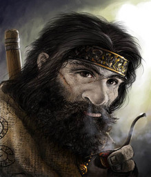

# Craiuk Runeheart
*Craiuk is a treasure-hunting dwarf rogue specializing in infiltrating ancient runes*

Lawful Good Male Hill Dwarf Rogue (1)

## Stats
|**Ability**|**STR**|**\*DEX\***|**CON**|**\*INT\***|**WIS**|**CHA**|
| ---- | ---- | ---- | ---- | ---- | ---- | ---- |
|Mod (Val)| +1 (13) | +2 (15) | +2 (14) | +2 (14) | +0 (11) | -1 (8) |
|**Save**| +1 | +4 | +2 | +4 | +0 | -1 |

- AC: 14
- Init: +2
- Size: Medium
- Speed: 25
- HD: 1 / 1d8
- hp: 11 / 11
- Proficiency: +2

### Offense
Craiuk prefers melee fighting to ranged combat, making every opportunity to exploit sneak attacks.

| Weapon | Attack Bonus | Damage | Notes |
| ---- | ---- | ---- | ---- |
| light crossbow | +4 | 1d8+2 (pierce) | range 80/320, loading, 20/20 bolts|
| short sword | +4 | 1d6+2 (pierce) ||

| Skill | Mod | Notes
| ---- | ---- | ---- |
| Acrobatics (Dex) | +4 | (P) |
| Animal Handling (Wis) | +0 ||
| Arcana (Int) | +2 ||
| Athletics (Str) | +1 ||
| Deception (Cha) | -1 ||
| History (Int) | +4 | (P) stonework: +6 |
| Insight (Wis)| +0 ||
| Intimidation (Cha) | -1 ||
| Investigation (Int) | +6 | (P-E) |
| Medicine (Wis) | +0 ||
| Nature (Int) | +2 ||
| Perception (Wis) | +0 | 10 passive |
| Performance (Cha) | -1 ||
| Persuasion (Cha) | +1 | (P) |
| Religion (Int) | +2 ||
| Sleight of Hand (Dex) | +4 | (P) |
| Stealth (Dex) | +4 | (P) |
| Survival (Wis) | +0 ||

### Abilities

- **Darkvision**: 60’
- **Dwarven Resilience**: Advantage on save vs poison, resistance vs poison damage
- **Stonecunning**: 2x proficiency bonus for History(Int) with respect to stonework
- **Dwarven Toughness**: +1 hp per level
- **Position of Privilege**
- **Expertise**: 2x proficiency bonus (Thieves' Tools, Investigation)
- **Sneak Attack**: +1d6 damage

### Proficiencies

- light armor
- simple weapons, battleaxe, handaxe, throwing hammer, warhammer, hand crossbow, longsword, shortsword, rapier 
- brewer’s supplies, dragonchess, thieves’ tools(E)

### Languages

Common, Dwarvish, Thieves' Cant, Orc 

## Gear

- studded leather armor
- signet ring
- dungeoneering pack
- thieves’ tools
- curious stone from Viperwall

### Funds

## Personality/Mannerisms

- Crauik tends to be gruff and short-tempered, and he has no patience for foolishness.
    - often more than a bit bossy
- Revels in the thrill of exploring ancient ruins, cracking their secrets, and extracting their treasures
- Exceptionally organized and methodical, particularly when it comes to infiltrating dungeons or ruins.
- Gets flustered when having to make snap decisions and hates improvising
- Doesn't make friends easily, but extremely loyal to them

### Quips

### Traits

- I believe that anything worth doing is worth doing right. I’m a perfectionist
- I am very competitive and never pass up a friendly wager

### Ideals

- **Obligation**: My duty is to protect and care for my clan

### Bonds

- An alliance with another family must be maintained at all costs

### Flaws

- I’d rather shave my beard than admit when I am wrong

## Background (Noble)

Craiuk was born and raised in the dwarven kingdom of Thranadar in the Mindspin Mountains, where he grew up under a continual state of conflict, primarily with the orc tribes of the Hold of Belkzen. Ancient secrets and lore fascinated him from an early age, and he apprenticed himself to an archaeologist guild where he specialized in infiltrating and exploring ancient sites. He fell under the tutelage of Dagur Dreadbrow, who had a fascination with a legendary ancient serpentfolk empire, particularly its fabled city of Saventh-Yhi.

Craiuk was part of Dagur Dreadbrow's team investigating a ruined fortress, Viperwall, in Varisia. While exploring the ruin they were attacked by a humanoid serpent creature. Only Dagur and Craiuk made it out alive, but they didn't escape empty handed. While Dagur headed to Magnimar to visit the Great Library with his notes, he sent Craiuk on to Cheliax to begin preparations for an expedition into the Mwangi Expanse.

### Campaign Introduction
The plan was to meet on the Jenivere, a ship that Dagur had used in the past and whose captain he trusted. When the Jenivere arrived at Corentyn, Dagur was not aboard. Rather word arrived that he had been slain in Magnimar. Craiuk boarded the Jenivere determined to continue his mentor's mission.

### History

* Homeland: Mindspin Mountains
* Circumstances of Birth: Heir to a Legacy
    * Thorid is an old line that has long held a position of nobility within the Delgirn clan.
* Parents: Both alive
    * Banur (father) and Vada (mother)
* Siblings: Craiuk is the youngest son
    * Older brothers - Valli, Fulrok
    * Younger sister - Rega
* Parent's Professions: Nobles
* Childhood Event: The War
    * Craiuk grew up under a continual state of conflict, primarily with the orc tribes of the Hold of Belkzen.  
* Training: The Trained
* Influential Associate: 
* Moral Conflict: Major theft
    * subject: Rival
    * motivation: Jealousy
    * resolution: Mixed feelings
* Romantic Relationships: One significant

### Family / Allies
* Thorid family of the Delgirn clan
    * parents: Banur (father) and Vada (mother)
    * older brothers (Valli, Fulrok)
    * sister (Rega)

### Enemies / Antagonists
* school rival still have personal grudge

### Contacts
* Cheiton (Kalabuto)

### Big Goals / Motivations

1. Uncover ancient secrets and riches that could yield weapons or powers to aid his home kingdom in its fight against the orcs.
    * Bring honor to self, family, and clan
2. Honor his mentor by continuing his research into fabled city of Saventh-Yhi
3. Vengeance against whomever killed his mentor, Dagur Dreadbrow
    1. Yazroth hunted Dagur Dreadbrow down in Magnimar and killed him. From his notes she decided to take the Jenivere, planning to kill his apprentice with the rest of the crew.

### Secrets
1. Crauik has one of the stones required to activate the Pillars of Light (SS-02), but he doesn't realize the stone's purpose
2. Stole a prized relic from a rival. Public knowledge of this would bring shame to family
3. Craiuk has loose ties with the Ninth Battalion faction
    1. many of the expeditions that Dagur Dreadbrow led involved missions for the faction. 

### Story Arcs
1. Rivalry: Craiuk's rival from the academy will resurface, supporting another faction and still bearing a grudge