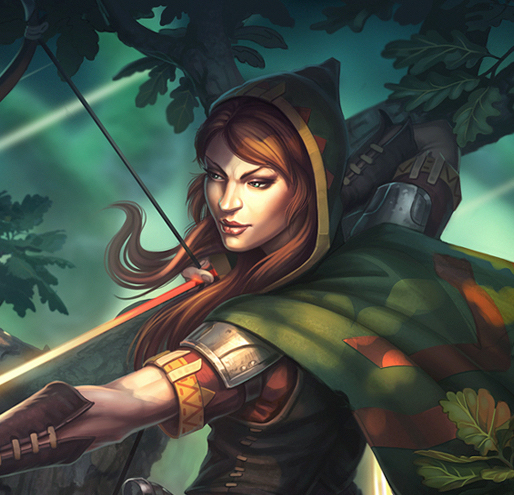
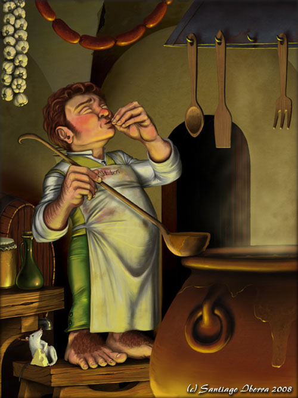

# Frickley

Frickley is a small, sleepy village made up of around 30 houses that sit within the confines of a 10’ wooden palisade.

## Town Stats

- **Population**: 152 (31 families).
- **Governance**: Town council
- **Trade**: wheat, fur
- **Occupations**:
	- 8 farmers
	- 10 hunters
	- 5 artisans
	- 6 laborers
	- 2 paupers
- **Locations of Note**
	- Shrine to Loviatar
	- The Blue Duke Inn
	- General Store

## NPCs of Note

### Grigor Dunhold

*Human male. Farmer. Tall.*

- **Ideal**: The world beyond our walls is a crazy, dangerous place. The common people like me need to stay together if we’re going to be safe.
- **Bond**: The village of Frickley has been my home all my life. I’d give anything to keep it safe.
- **Flaw**: Outsiders, especially ones that act as though they’re better than us, are always trying to exploit the common people.

### Tastra Fleetstrong

*Half-Elf female. Hunter. Red hair.*


- **Ideal**: In the wild, the most important thing is making sure you can take care of yourself and your family.
- **Bond**: Frickley has been good to me over the years, but villages are made of people, not houses.
- **Flaw**: I have no respect for anybody who can’t make themselves useful or who doesn’t show ambition. Who would want to spend their entire life tending to the same field over and over again?

### Pello Stoutpipe

*Halfling male. Innkeeper. Ruddy-faced.*


- **Ideal**: Home and hearth – there is nothing more important.
- **Bond**: I’ve worked hard to create a livelihood in Frickley – I’m not going to abandon it.
- **Flaw**: I am very stubborn; once I’ve made my mind up, there is no use trying to reason with me.

### Ithro Addelm (minor aristocrat)
*A well-spoken human male. Noble. Heavy sideburns*

### Josina Springtide (local priest)

*A compassionate human female. Priest. Dumpy with frizzy hair*

### Nilril Graybow	(former sheriff)
*A gruff half-elf male. Retired Sheriff. Missing digits on right hand*